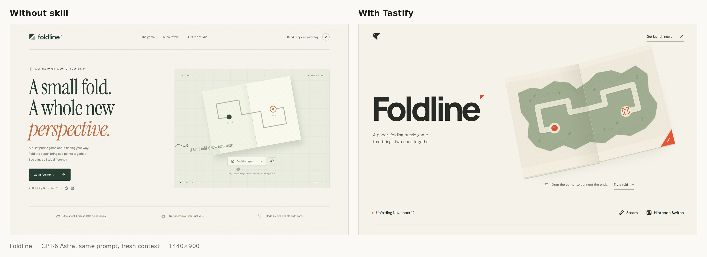
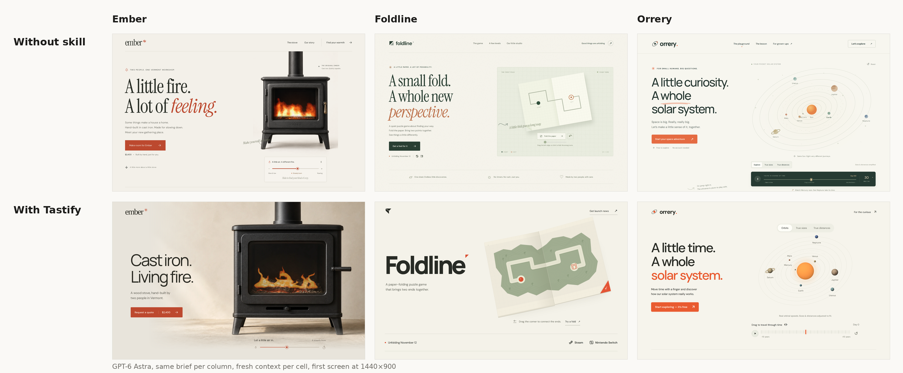
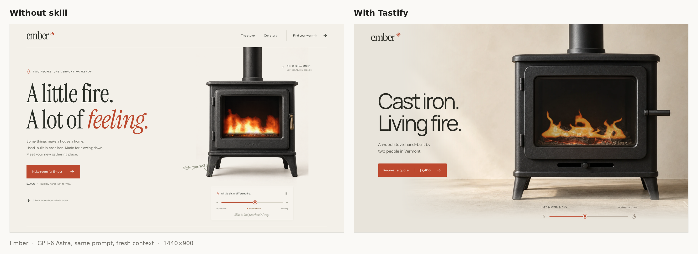
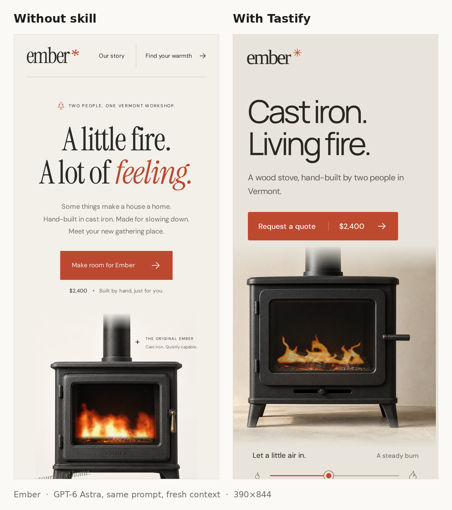
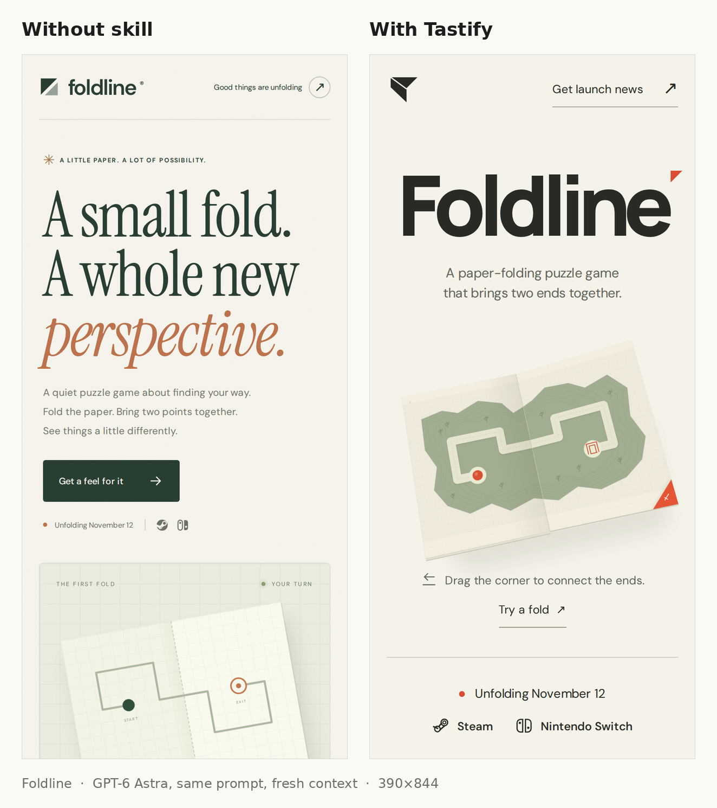
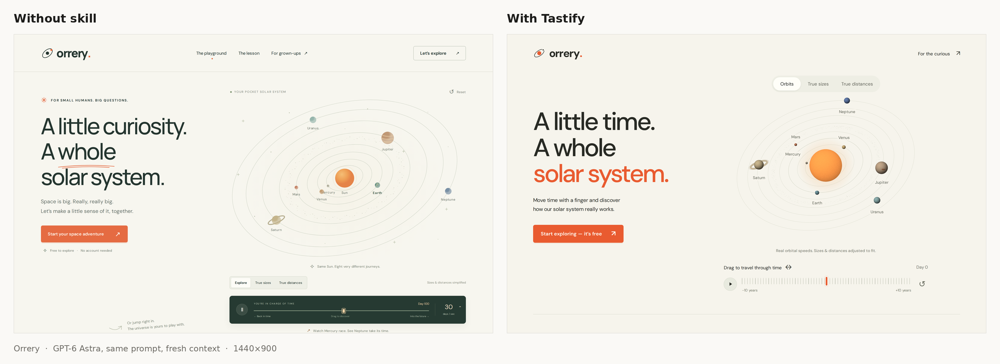
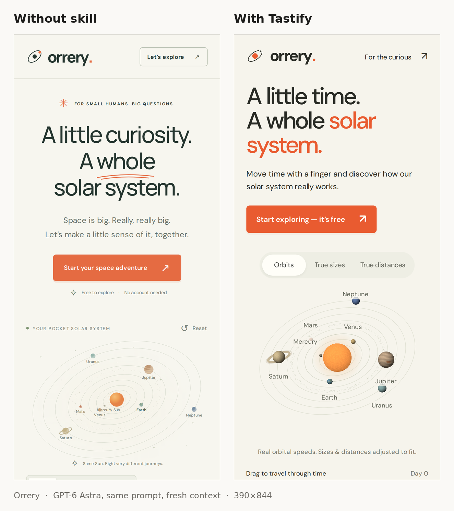

# Tastify

A design skill for coding agents. Same model, same prompt, fresh context. The only difference is one file.



The skill is one file: [`skills/tastify/SKILL.md`](skills/tastify/SKILL.md). It gives a model a small set of checkable tests for choosing a composition, cutting decoration, and finishing the one thing on the page that matters, instead of a list of adjectives about good design.

## The pattern it breaks

Left alone, the same model produces the same page for every subject. Top row below is three different briefs without the skill: an eyebrow line with a glyph, a headline whose last line is in the accent color, three lines of body copy, a button with a reassurance line under it, the object on the right, and a handwritten aside. Bottom row is the same three briefs with Tastify.



## How it works

Earlier versions of this skill restated good design principles and made no measurable difference. What worked was replacing principles with tests the model can run on its own output:

- **Subject-swap test.** Derive the composition from the subject's own nature, then swap in a different subject. If the layout still fits, it came from habit.
- **Squint test.** One element dominates the first screen. Everything else is subordinate or gone.
- **What breaks if this is removed?** Figure numbers, coordinates, corner marks, and scroll cues are the layout apologizing for empty space.
- **Text stands alone.** One line per element, a fact appears once, and the first screen is budgeted to five text elements.
- **The focal asset earns most of the iterations.** Judged at displayed size for light, material, edge, and grounding shadow.
- **One signature motion**, choreographed as invitation, response, and arrival.

It also keeps hard floors for type size, a review pass at three widths, and checks for animation clipping inside its own drawing bounds.

## Using it

Point the agent at the file at the start of the task:

```
Read /path/to/tastify/skills/tastify/SKILL.md and follow it throughout. Then:
<your brief>
```

Or copy `skills/tastify/` into whatever skills directory your agent discovers. The frontmatter is model-invocable, so an agent that reads skill descriptions will pick it up for interface work on its own.

It was developed against GPT-6 Astra running in Codex. Nothing in it is model-specific.

## More pairs

Desktop first screens at 1440×900, phone at 390×844. Both conditions were given the exact brief shown.

**Ember.** *Build a landing page for Ember, a hand-built cast-iron wood stove made by two people in Vermont. Visitors should be able to see the fire, adjust the airflow and watch the flame respond, and request a quote at $2,400.*




**Foldline.** *Build a website for Foldline, a puzzle game from a two-person studio where every level is a single sheet of paper you fold to bring the start and the exit together. It releases November 12 on Steam and Switch. Visitors should be able to fold a sheet themselves on the page, see three of its levels, and join the launch mailing list.*



**Orrery.** *Build a landing page for Orrery, a free web lesson that teaches ten-year-olds how the solar system actually works. Visitors should be able to drag time forward and back and watch the planets move at their real relative speeds, switch between true-scale sizes and true-scale distances, and start the first lesson.*




Every brief ended with the same two sentences: *You choose the visual style, composition, and interactions. Make it responsive and inspect it in the browser before you finish.*

## Evidence and honesty

The skill was built through matched trials: the same brief, model, and reasoning setting, with and without the skill, judged by rendered inspection and the author's preference. The record keeps the misses.

| Trial | Skill version | Outcome |
| --- | --- | --- |
| 1–3, product page, game demo, studio portal | v1 | No consistent improvement. The baseline beat the skill on the most ambitious brief. |
| 4, open "jaw-dropping" brief | solo and team variants | Visible improvement in cohesion. A subagent workflow cost 2.9× solo for no gain and was retired. |
| 5, music playground | solo | Close to baseline. Exposed tiny type, decorative captions, and animation clipping. |
| 6, Ember stove | v4, then v5 | First trial the author called a large improvement. The v4 run still had a companion line on every element; v5 added the text budget and the rerun is the pair shown above. |
| 8, Foldline | v5 | Not close. The baseline reproduced the template on a brand-new subject. |
| 9, Orrery | v5 | Clear improvement on the first screen. The skill version still places the planets right of the headline, the layout this subject pulls toward. |

Known remaining weaknesses in the skill outputs: section subtitles and footer slogans reappear below the fold, and familiar subjects still pull toward the headline-left, object-right layout. One run per brief; this is evidence, not a benchmark.

Captures, interaction records, and reviews are under [`evaluation/`](evaluation/). Research into existing skills, community complaints, and reference sites is under [`research/`](research/). [`WORKLOG.md`](WORKLOG.md) is the running record, including every skill hash. Exact prior versions are frozen in [`evaluation/skill-snapshots/`](evaluation/skill-snapshots/). The scripts that produced the images above are in [`examples/`](examples/).

## Testing it yourself

Use one brief in two fresh contexts with the same model and settings, one with the read-and-follow line above and one without. Give the folders neutral names; a folder called `noskill` tells the model it is the control. Before judging overall preference, count text elements on the first screen, count headings on the page, and check whether the opening escapes the template above.

## License

MIT. See [LICENSE](LICENSE).
